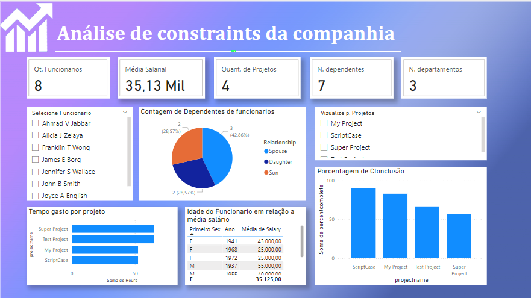
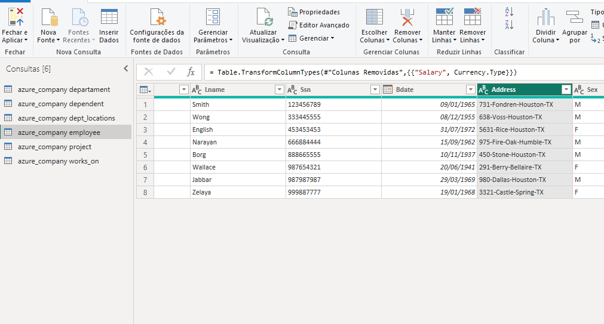

# Criando um Dashboard Corporativo com integraçã com MySQL e Azure

## Descrição do Desafio

### Visão Geral
1.	Criação de uma instância na Azure para MySQL
2.	Criar o Banco de dados com base disponível no github
3.	Integração do Power BI com MySQL no Azure 
4.	Verificar problemas na base a fim de realizar a transformação dos dados

### Diretrizes para transformação dos dados

1.	Verifique os cabeçalhos e tipos de dados
2.	Modifique os valores monetários para o tipo double preciso
3.	Verifique a existência dos nulos e analise a remoção
4.	Os employees com nulos em Super_ssn podem ser os gerentes. Verifique se há algum colaborador sem gerente
5.	Verifique se há algum departamento sem gerente
6.	Se houver departamento sem gerente, suponha que você possui os dados e preencha as lacunas
7.	Verifique o número de horas dos projetos
8.	Separar colunas complexas
9.	Mesclar consultas employee e departament para criar uma tabela employee com o nome dos departamentos associados aos colaboradores. A mescla terá como base a tabela employee. Fique atento, essa informação influencia no tipo de junção
10.	Neste processo elimine as colunas desnecessárias. 
11.	Realize a junção dos colaboradores e respectivos nomes dos gerentes . Isso pode ser feito com consulta SQL ou pela mescla de tabelas com Power BI. Caso utilize SQL, especifique no README a query utilizada no processo.
12.	Mescle as colunas de Nome e Sobrenome para ter apenas uma coluna definindo os nomes dos colaboradores
13.	Mescle os nomes de departamentos e localização. Isso fará que cada combinação departamento-local seja único. Isso irá auxiliar na criação do modelo estrela em um módulo futuro.
14.	Explique por que, neste caso supracitado, podemos apenas utilizar o mesclar e não o atribuir. 

## Explicações

Por utilizar maquina e contas corporativas, não possuo mais acesso ao Azure. Desse modo, os dados foram criados num banco local, para ser utilizado com o relatório solicitado.

## Passo-a-passo

Assim que o banco foi criado e a integração com o PowerBI foi feita, foram seguidos os seguintes passos:

### 1.	Verificação dos cabeçalhos e dos tipos de dados
### 2.	Atualização dos valores monetários para o tipo double preciso
### 3.	Verificação da presença de nulos
### 4.	Remoção das colunas criadas pelo Power BI
### 5.	Coluna address, da tabela employee, foi dividida, e alguns dados das colunas foram corrigidos e reorganizados
> Number
> Street
> City
> State
 
**Antes da divisão**

**Depois da divisão**

>5.	Foi realizada a mescla de consultas entre as tabelas employee e departament para criação de uma nova tabela employee com o nome dos departamentos associados aos colaboradores. A mescla teve como base a tabela employee utilizando-se os campos Dno e Dnumber como referência. Após a criação da mescla as colunas Dnumber e todas a outras de departament foram excluídas exceto Dname que foi renomeada para Departament. 

**Parâmetros da Mescla de Consultas**

**Resultado da Mescla de Consultas**

>6.	Foi realizada a junção dos colaboradores e respectivos nomes dos gerentes. A junção foi realizada no Power BI e Utilizou-se a tabela employee para criação da mescla de tabelas. A mesma tabela foi utilizada para obter a junção fazendo a ligação de Super_Ssn com Ssn.

**Parâmetros da Mescla de Consultas**

**Resultado da Mescla de Consultas**

>7.	As colunas de Nome e Sobrenome foram mescladas para ter apenas uma coluna definindo o nome dos colaboradores. Foi utilizada a opção de mesclar colunas com o sperador espaço selecionado, após a mescla a coluna foi renomeada para Name.

**Parâmetros da Mescla de Colunas**

**Resultado da Mescla de Colunas**

>8.	Foi criada uma nova mescla de consultas entre as tabelas departament e dept_locations utilizando as colunas Dnumber como parâmetro, a tabela gerada gerada foi renomeada para dept_namelocation, as colunas desnecessárias e duplicadas foram removidas e a mescla de colunas entre as colunas Dname e Dlocation foi realizada.

**Parâmetros da Mescla de Consultas**

**Resultado da Mescla de Consultas**

>9.	No passo anterior foi utilizada a opção mesclar consultas e não a opção acrescentar visto que a há uma coluna em comum que combina as duas consultas. 

>10.	Foi realizado o agrupamento das colunas Manager e employee a fim de saber quantos colaboradores existem por gerente.  

**Parâmetros do Agrupamento de Colunas**

**Resultado do Agrupamento de Colunas**

Relatório desenvolvido por Cibele Gomes Domingos Moraes .
