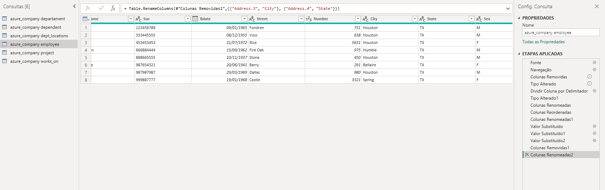
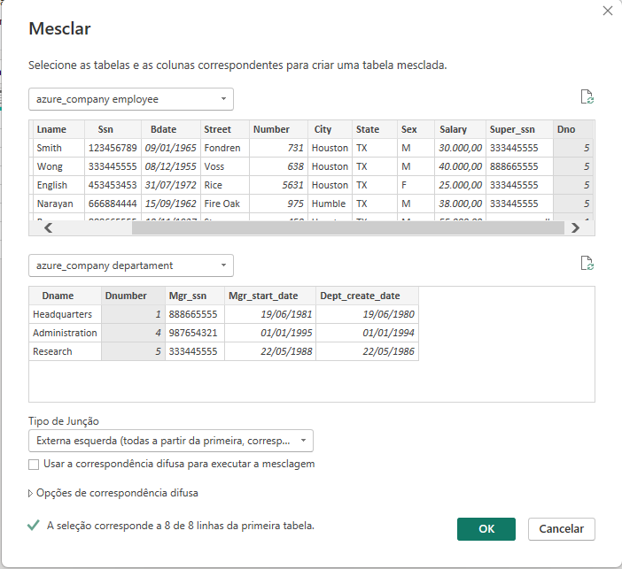
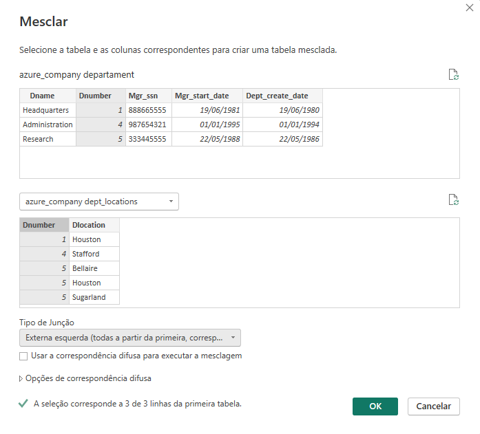

# Criando um Dashboard Corporativo com integraçã com MySQL e Azure

## Descrição do Desafio

### Visão Geral
1.	Criação de uma instância na Azure para MySQL
2.	Criar o Banco de dados com base disponível no github
3.	Integração do Power BI com MySQL no Azure 
4.	Verificar problemas na base a fim de realizar a transformação dos dados

### Diretrizes para transformação dos dados

1.	Verifique os cabeçalhos e tipos de dados
2.	Modifique os valores monetários para o tipo double preciso
3.	Verifique a existência dos nulos e analise a remoção
4.	Os employees com nulos em Super_ssn podem ser os gerentes. Verifique se há algum colaborador sem gerente
5.	Verifique se há algum departamento sem gerente
6.	Se houver departamento sem gerente, suponha que você possui os dados e preencha as lacunas
7.	Verifique o número de horas dos projetos
8.	Separar colunas complexas
9.	Mesclar consultas employee e departament para criar uma tabela employee com o nome dos departamentos associados aos colaboradores. A mescla terá como base a tabela employee. Fique atento, essa informação influencia no tipo de junção
10.	Neste processo elimine as colunas desnecessárias. 
11.	Realize a junção dos colaboradores e respectivos nomes dos gerentes . Isso pode ser feito com consulta SQL ou pela mescla de tabelas com Power BI. Caso utilize SQL, especifique no README a query utilizada no processo.
12.	Mescle as colunas de Nome e Sobrenome para ter apenas uma coluna definindo os nomes dos colaboradores
13.	Mescle os nomes de departamentos e localização. Isso fará que cada combinação departamento-local seja único. Isso irá auxiliar na criação do modelo estrela em um módulo futuro.
14.	Explique por que, neste caso supracitado, podemos apenas utilizar o mesclar e não o atribuir. 

## Explicações

Por utilizar maquina e contas corporativas, não possuo mais acesso ao Azure. Desse modo, os dados foram criados num banco local, para ser utilizado com o relatório solicitado.

## Passo-a-passo

Assim que o banco foi criado e a integração com o PowerBI foi feita, foram seguidos os seguintes passos:

1.	Verificação dos cabeçalhos e dos tipos de dados
2.	Atualização dos valores monetários para o tipo double preciso
3.	Verificação da presença de nulos
4.	Remoção das colunas criadas pelo Power BI
5.	Coluna **address**, da tabela **azure_company_employee**, foi dividida, e alguns dados das colunas foram corrigidos e reorganizados:
   - Number
   - Street
   - City
   - State
 
**Antes da divisão**

**Depois da divisão**

6.	Foi criada uma tabela mesclada, entre **azure_company_employee** e **azure_company_department**, com o nome dos departamentos relacionados aos funcionários.
   - Utilizamos as colunas Dno e Dnumber como referência.

7. Após a criação da tabela nova, excluimos todas as colunas relacionadas a departamento, exceto a coluna **Dname**, que renomeamos para **Departament**. 

**Mescla das tabelas**

**Resultado da Mescla**

8. Utilizamos o Power BI para reorganizar a tabela **employee**, deixando junto aos seus nomes o nome do respectivo gerente, utilizando as colunas **Super_Ssn** e **Ssn**

**Nova coluna Manager**

9. Juntamos as colunas de nome e sobrenome, renomeando como Name.

**Nova coluna Name**

10. Foi criada uma tabela mesclada, **dept_namelocation**, mesclando as tabelas **azure_company_department** e **azure_company_dept_locations**
   - Utilizamos a coluna Dnumber como referência.
   - Removemos as colunas desnecessárias e duplicadas

**Mescla das tabelas**

**Resultado da Mescla**

11. Agrupamos as colunas **employee** e **manager**, para saber quantos funcionários há por gerente.

**Configuração do Agrupamento**

**Resultado do Agrupamento**

