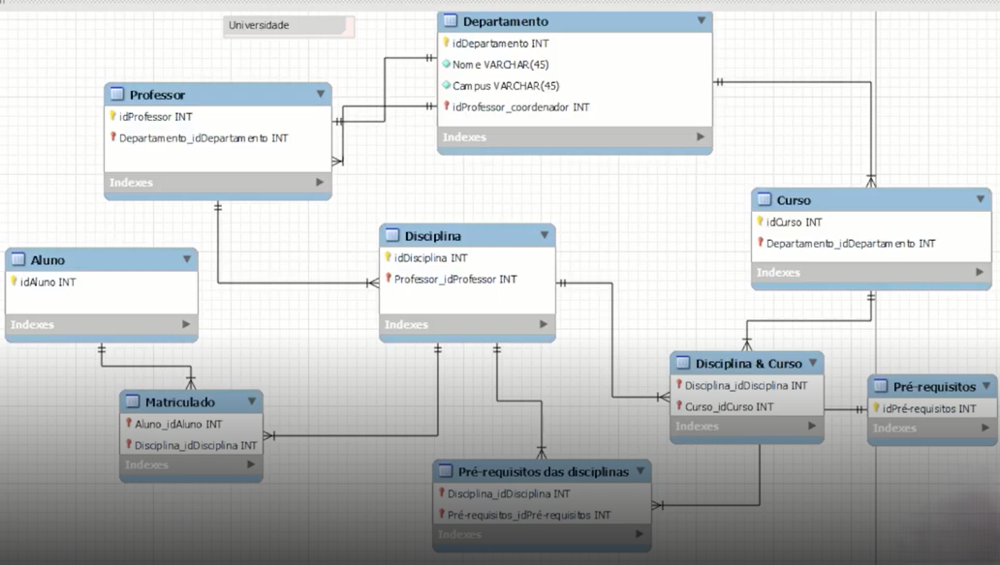
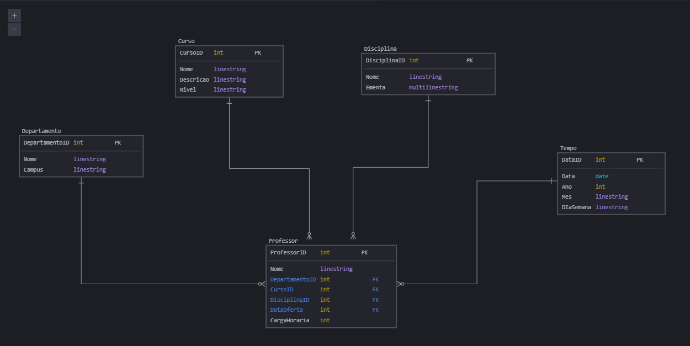

# Dashboard de Vendas de PowerBI utilizando Star Schema

## Descrição do Desafio

### Objetivo

Criar o diagrama dimensional – star schema – com base no diagrama relacional disponibilizado.

### Foco

Professor – objeto de análise

Vocês irão montar o esquema em estrela com o foco na análise dos dados dos professores. Sendo assim, a tabela fato deve refletir diversos dados sobre professor, cursos ministrados, departamento ao qual faz parte.... Por aí vocês já têm uma ideia do que deve compor a tabela fato do modelo em questão. 
Obs.: Não é necessário refletir dados sobre os alunos!

### O que deve ser feito?

Deverá ser criada a tabela Fato que contêm o contexto analisado. Da mesma forma, é necessária a criação das tabelas dimensão que serão compostas pelos detalhes relacionados ao contexto.
Por fim, mas não menos importante, adicione uma tabela dimensão de datas. Para compensar a falta de dados de datas do modelo relacional, suponha que você tem acesso aos dados e crie os campos necessários para modelagem. 
Ex: data de oferta das disciplinas, data de oferta dos cursos, entre outros. O formato, ou melhor, a granularidade, não está fixada. Podem ser utilizados diferentes formatos que correspondem a diferentes níveis de granularidade.

### Imagem de referência

### Resolução

Após analisar o pedido, chegou-se à seguinte solução, feita no site **SQLDBM**

